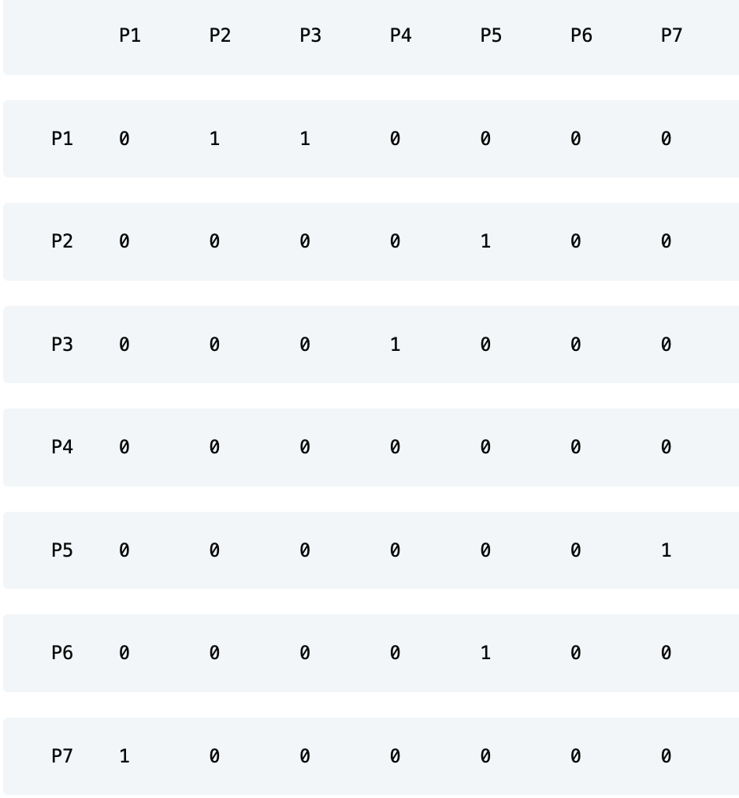
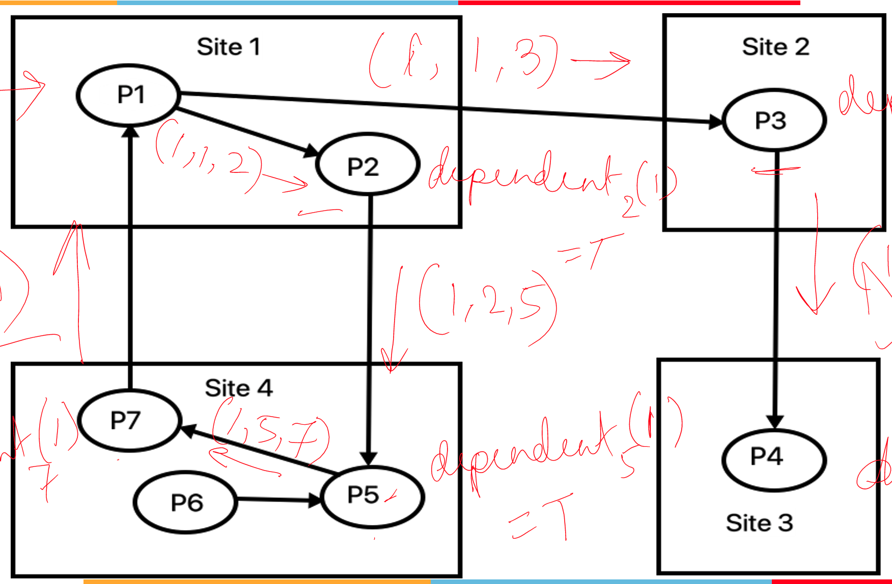
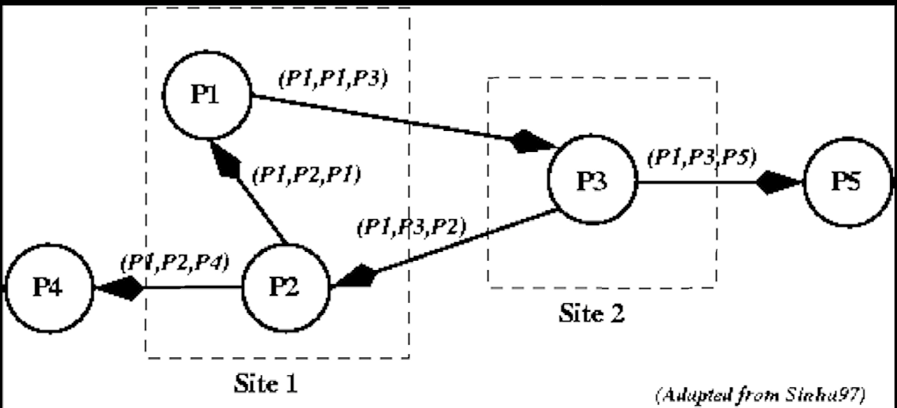
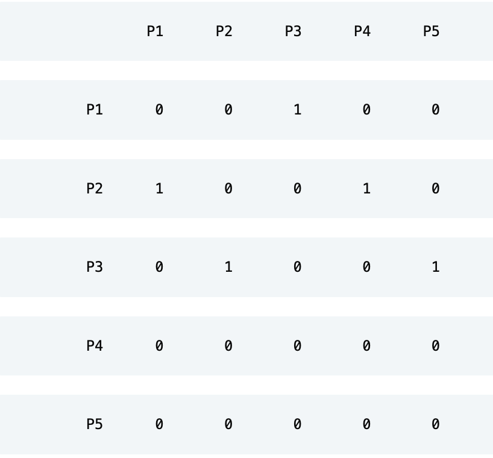
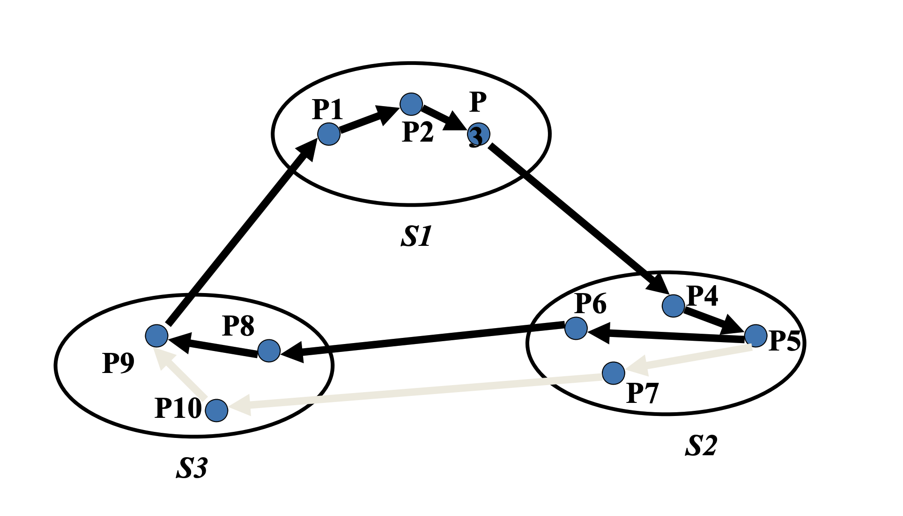
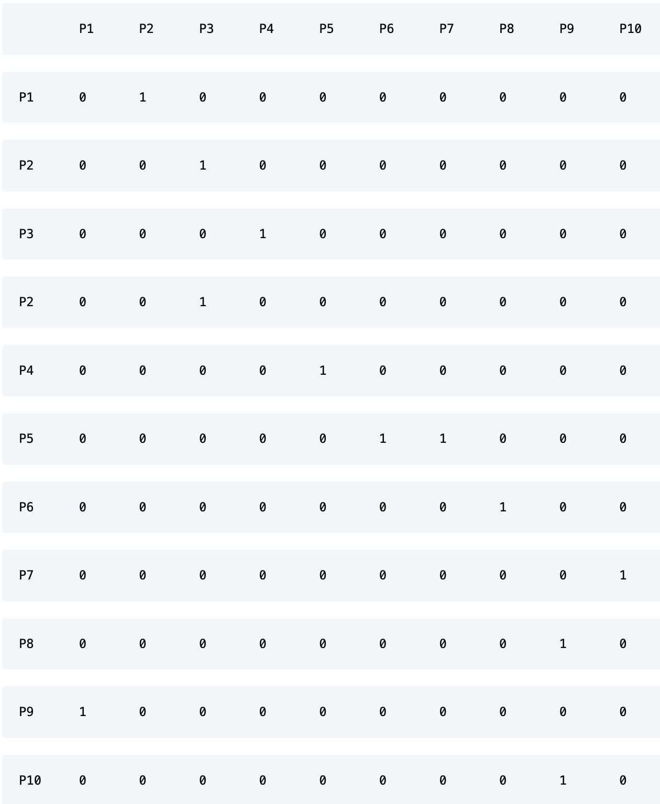

**Overview**
- This project is to implement Chandy Misra Haas Algorithm for Distributed Deadlock Detection
- **Author** - Raghunandan Gupta
- **Student Id** - 2022mt13103
- **Email** -  2022mt13103@wilp.bits-pilani.ac.in
- **Course** - Distributed Computing
- **Course Id** - SSZG526

**Environment Setup**
- The user should have working installation of Java 8 or above
- To check Java compiler is installed
  - javac -version
- To check Java Run time is present
  - java -version
- Below commands are for executing the program. Make sure you are inside the directory where Java file is present
  - javac ChandyMisraHaas.java
  - java ChandyMisraHaas
- 3 examples are already prefilled in the code. You have to provide the site, process & Edge Details.

**Overview**
- There can be multiple Sites
- Sites can have multiple Processes
  - Sites can't have processes with same id
- There can be multiple edges among processes
  - There can't be edge having same source and destination
- Algorithm will execute for each node present in edge. It will treat as Originator and will send message to all the nodes present in edge 
- Message Format
  - (Originator, Source, Destination)
  - (1,1,3)
- Algorithms will execute for each of the Process present in Edges and one by one.
  - At each iteration one of the node will work as Originator
- If Cycle is found code will terminate else it will continue till all processes present in Edges are checked
- You can have one ste with different processes, or you can have multiple site with different processes.

**Edge Cases**
- At least 1 Site must be present
- At least 2 processes must be present
- There can't be edge where source and destination processes are same

- **Below is Sample Input Sequence as per the Program**
  - ########Chandy Misra Haas Algorithm########
  - Please enter number of sites (In Numeric Format only)
  **4**
  - Please enter processes (comma separated numeric integers e.g. 1,2,3...) in Site 1 :
  **1,2,3**
  - Please enter processes (comma separated numeric integers e.g. 1,2,3...) in Site 2 :
  **4**
  - Please enter processes (comma separated numeric integers e.g. 1,2,3...) in Site 3 :
  **5**
  - Please enter processes (comma separated numeric integers e.g. 1,2,3...) in Site 4 :
  **6,7**
  - Please enter number of edges (In Numeric Format only)
  **7**
  - Please enter edge 1 (Source, Destination) E.g. P1,P2. Process List is : [P1, P2, P3, P4, P5, P6, P7]
  **P6,P5**
  - Edge P6 -> P5 added successfully
  - Please enter edge 2 (Source, Destination) E.g. P1,P2. Process List is : [P1, P2, P3, P4, P5, P6, P7]
  **P1,P2**
  - Edge P1 -> P2 added successfully
  - Please enter edge 3 (Source, Destination) E.g. P1,P2. Process List is : [P1, P2, P3, P4, P5, P6, P7]
  **P1,P3**
  - Edge P1 -> P3 added successfully
  - Please enter edge 4 (Source, Destination) E.g. P1,P2. Process List is : [P1, P2, P3, P4, P5, P6, P7]
  **P2,P5**
  - Edge P2 -> P5 added successfully
  - Please enter edge 5 (Source, Destination) E.g. P1,P2. Process List is : [P1, P2, P3, P4, P5, P6, P7]
  **P3,P4**
  - Edge P3 -> P4 added successfully
  - Please enter edge 6 (Source, Destination) E.g. P1,P2. Process List is : [P1, P2, P3, P4, P5, P6, P7]
  **P7,P1**
  - Edge P7 -> P1 added successfully
  - Please enter edge 7 (Source, Destination) E.g. P1,P2. Process List is : [P1, P2, P3, P4, P5, P6, P7]
  **P5,P7**
  - Edge P5 -> P7 added successfully

**Sample Output**
* Chandy-Misra-Haas Distributed Deadlock Detection Algorithm
* Number of sites: 4
* Site1	P1,P2
* Site2	P3
* Site3	P4
* Site4	P5,P6,P7
* Edges - P6->P5, P1->P2, P1->P3, P2->P5, P3->P4, P7->P1, P5->P7
* Adjacency Matrix for representing edges
* 

* Originator P6
  * P6 -> P5 with Probe (6,6,5)
  * P5 -> P7 with Probe (6,5,7)
  * P7 -> P1 with Probe (6,7,1)
  * P1 -> P2 with Probe (6,1,2)
  * P1 -> P3 with Probe (6,1,3)
  * P2 -> P5 with Probe (6,2,5)
  * P3 -> P4 with Probe (6,3,4)
  * Discarding Probe (6,3,4) because P4 is active process.

* Originator P1
  * P1 -> P2 with Probe (1,1,2)
  * P1 -> P3 with Probe (1,1,3)
  * P2 -> P5 with Probe (1,2,5)
  * P3 -> P4 with Probe (1,3,4)
  * P5 -> P7 with Probe (1,5,7)
  * Discarding Probe (1,3,4) because P4 is active process.
  * P7 -> P1 with Probe (1,7,1)
  * Both Originator and Destination are same for (1,7,1) Cycle detected. Hence deadlock is present.

- **Pre coded examples**
  - **Example 1**
  - 
  - **Solution 1** 
    * Chandy-Misra-Haas Distributed Deadlock Detection Algorithm
    * Number of sites: 4
    * Site1	P1,P2
    * Site2	P3
    * Site3	P4
    * Site4	P5,P6,P7
    * Edges - P6->P5, P1->P2, P1->P3, P2->P5, P3->P4, P7->P1, P5->P7
    * Adjacency Matrix for representing edges
    * 

    * Originator P6
      * P6 -> P5 with Probe (6,6,5)
      * P5 -> P7 with Probe (6,5,7)
      * P7 -> P1 with Probe (6,7,1)
      * P1 -> P2 with Probe (6,1,2)
      * P1 -> P3 with Probe (6,1,3)
      * P2 -> P5 with Probe (6,2,5)
      * P3 -> P4 with Probe (6,3,4)
      * Discarding Probe (6,3,4) because P4 is active process.

    * Originator P1
      * P1 -> P2 with Probe (1,1,2)
      * P1 -> P3 with Probe (1,1,3)
      * P2 -> P5 with Probe (1,2,5)
      * P3 -> P4 with Probe (1,3,4)
      * P5 -> P7 with Probe (1,5,7)
      * Discarding Probe (1,3,4) because P4 is active process.
      * P7 -> P1 with Probe (1,7,1)
      * Both Originator and Destination are same for (1,7,1) Cycle detected. Hence deadlock is present.
    
  - **Example 2** 
    - 
    - **Solution 2**
      * Simulating Chandy_Misra_haas_and_eg_2 image attached in the assignment
      * Chandy-Misra-Haas Distributed Deadlock Detection Algorithm
      * Number of sites: 2
      * Site1	P1,P2,P4
      * Site2	P3,P5
      * Edges - P1->P3, P3->P5, P2->P1, P2->P4, P3->P2
      * Adjacency Matrix for representing edges
      
      * Originator P1
        * P1 -> P3 with Probe (1,1,3)
        * P3 -> P5 with Probe (1,3,5)
        * P3 -> P2 with Probe (1,3,2)
        * Discarding Probe (1,3,5) because P5 is active process.
        * P2 -> P1 with Probe (1,2,1)
        * P2 -> P4 with Probe (1,2,4)
        * Both Originator and Destination are same for (1,2,1) Cycle detected. Hence deadlock is present.
    
  - **Example 3**
    - 
    - **Solution 3**
      Simulating Chandy_Misra_haas_and_eg_3 image attached in the assignment
      Chandy-Misra-Haas Distributed Deadlock Detection Algorithm
      * Number of sites: 3
      * Site1	P1,P2,P3
      * Site2	P4,P5,P6,P7
      * Site3	P8,P9,P10
      * Edges - P1->P2, P2->P3, P3->P4, P4->P5, P5->P6, P6->P8, P5->P7, P7->P10, P10->P9, P8->P9, P9->P1
      * Adjacency Matrix for representing edges
      *
      * Originator P1
        * P1 -> P2 with Probe (1,1,2)
        * P2 -> P3 with Probe (1,2,3)
        * P3 -> P4 with Probe (1,3,4)
        * P4 -> P5 with Probe (1,4,5)
        * P5 -> P6 with Probe (1,5,6)
        * P5 -> P7 with Probe (1,5,7)
        * P6 -> P8 with Probe (1,6,8)
        * P7 -> P10 with Probe (1,7,10)
        * P8 -> P9 with Probe (1,8,9)
        * P10 -> P9 with Probe (1,10,9)
        * P9 -> P1 with Probe (1,9,1)
        * Both Originator and Destination are same for (1,9,1) Cycle detected. Hence deadlock is present.* 